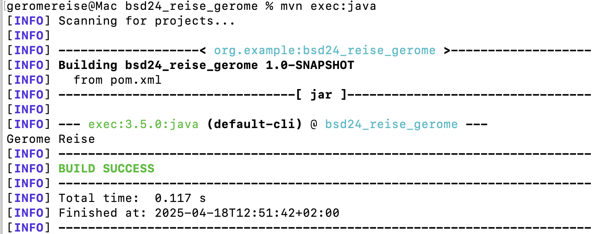

## Übung 3

## Versionen

## Schritt 1
Zuerst wurde die Software Maven installiert und die Version kontrolliert.

## Schritt 2
Die Umgebungsvariablen für Maven und Java wurden angepasst.

## Schritt 3
Ein neues Maven Intellj Projekt wurde angelegt und eine neue .md Datei erzeugt

## Schritt 4
Beim ausführen des Projektes, wurde ein target Ordner hinzugefügt.

## pom
Bild1:

Bild2:

## Logger
